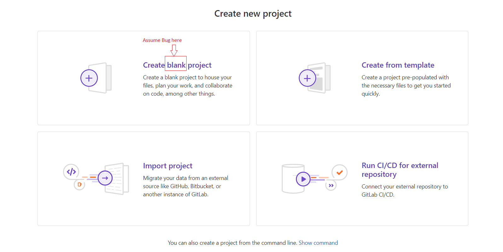

## Summary (Summarize the bug encountered concisely)

    Create new project -page contains a typo in the option "Create blank project" -title. The typo in the title is "black" while it should be "blank".

## Steps to reproduce

    1. Open Browser
    2. Login to GitLab
    3. Select New project
    4. Observe the "Create blank project" title.

## Example Project

    https://gitlab.com/VefiVek/bug-report

## What is the current bug behavior?

    The title typo is "Create black project".

## What is the expected correct behavior?

    The title should be "Create blank project".
     
## Relevant logs and/or screenshots

## Possible fixes

    Correct the typo located in:
    External JS file: /assets/webpack/pages.projects.new.11b6814e.chunk.js
    Line of code: 1085: title: Object(c.g)("ProjectsNew|Create blank project"), 
